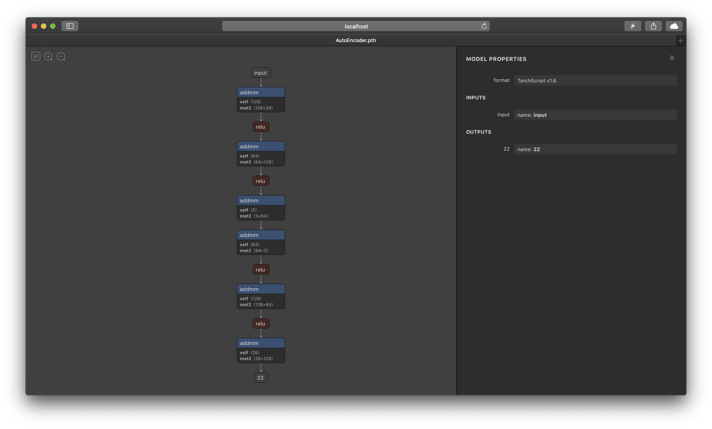

# Enchanter

[](https://app.codacy.com/manual/KawashimaHirotaka/enchanter?utm_source=github.com&utm_medium=referral&utm_content=khirotaka/enchanter&utm_campaign=Badge_Grade_Dashboard)
[](https://github.com/khirotaka/enchanter/actions)
[](https://github.com/khirotaka/enchanter/actions)
[](https://enchanter.readthedocs.io/ja/latest/?badge=latest)
[](https://pypi.org/project/enchanter/)
[](LICENSE)
[![Using PyTorch](https://img.shields.io/badge/PyTorch-red.svg?labelColor=f3f4f7&logo=data:image/svg+xml;base64,PD94bWwgdmVyc2lvbj0iMS4wIiBlbmNvZGluZz0iVVRGLTgiPz4KPHN2ZyB3aWR0aD0iMjU2cHgiIGhlaWdodD0iMzEwcHgiIHZpZXdCb3g9IjAgMCAyNTYgMzEwIiB2ZXJzaW9uPSIxLjEiIHhtbG5zPSJodHRwOi8vd3d3LnczLm9yZy8yMDAwL3N2ZyIgeG1sbnM6eGxpbms9Imh0dHA6Ly93d3cudzMub3JnLzE5OTkveGxpbmsiIHByZXNlcnZlQXNwZWN0UmF0aW89InhNaWRZTWlkIj4KICAgIDxnPgogICAgICAgIDxwYXRoIGQ9Ik0yMTguMjgxMDM3LDkwLjEwNjQxMiBDMjY4LjU3Mjk4OCwxNDAuMzk4MzYzIDI2OC41NzI5ODgsMjIxLjA3NTAzNCAyMTguMjgxMDM3LDI3MS43MTYyMzUgQzE2OS4wMzY4MzUsMzIyLjAwODE4NiA4OC4wMTA5MTQxLDMyMi4wMDgxODYgMzcuNzE4OTYzMiwyNzEuNzE2MjM1IEMtMTIuNTcyOTg3NywyMjEuNDI0Mjg0IC0xMi41NzI5ODc3LDE0MC4zOTgzNjMgMzcuNzE4OTYzMiw5MC4xMDY0MTIgTDEyNy44MjUzNzUsMCBMMTI3LjgyNTM3NSw0NS4wNTMyMDYgTDExOS40NDMzODMsNTMuNDM1MTk3OCBMNTkuNzIxNjkxNywxMTMuMTU2ODg5IEMyMi4wMDI3Mjg1LDE1MC4xNzczNTMgMjIuMDAyNzI4NSwyMTAuOTQ2Nzk0IDU5LjcyMTY5MTcsMjQ4LjY2NTc1NyBDOTYuNzQyMTU1NSwyODYuMzg0NzIgMTU3LjUxMTU5NiwyODYuMzg0NzIgMTk1LjIzMDU1OSwyNDguNjY1NzU3IEMyMzIuOTQ5NTIzLDIxMS42NDUyOTMgMjMyLjk0OTUyMywxNTAuODc1ODUzIDE5NS4yMzA1NTksMTEzLjE1Njg4OSBMMjE4LjI4MTAzNyw5MC4xMDY0MTIgWiBNMTczLjIyNzgzMSw4NC41MTg0MTc1IEMxNjMuOTY5MzM4LDg0LjUxODQxNzUgMTU2LjQ2Mzg0Nyw3Ny4wMTI5MjYzIDE1Ni40NjM4NDcsNjcuNzU0NDMzOCBDMTU2LjQ2Mzg0Nyw1OC40OTU5NDEzIDE2My45NjkzMzgsNTAuOTkwNDUwMiAxNzMuMjI3ODMxLDUwLjk5MDQ1MDIgQzE4Mi40ODYzMjMsNTAuOTkwNDUwMiAxODkuOTkxODE0LDU4LjQ5NTk0MTMgMTg5Ljk5MTgxNCw2Ny43NTQ0MzM4IEMxODkuOTkxODE0LDc3LjAxMjkyNjMgMTgyLjQ4NjMyMyw4NC41MTg0MTc1IDE3My4yMjc4MzEsODQuNTE4NDE3NSBaIiBmaWxsPSIjRUU0QzJDIj48L3BhdGg+CiAgICA8L2c+Cjwvc3ZnPgo=)](https://pytorch.org/)

Enchanter is a library for machine learning tasks for comet.ml users.

## Installation
To install the stable release.
```shell script
pip install enchanter
```

or

To install the latest(unstable) release. 
```shell script
pip install git+https://github.com/khirotaka/enchanter.git
```

If you want to install with a specific branch, you can use the following.
```shell script
# e.g.) Install enchanter from develop branch.
pip install git+https://github.com/khirotaka/enchanter.git@develop
```

## Documentation
*   [API Reference](https://enchanter.readthedocs.io/ja/latest/)
*   [Tutorial](https://enchanter.readthedocs.io/ja/latest/tutorial/modules.html)

## Getting Started
Try your first Enchanter Program. To train a neural network written in PyTorch on Enchanter, use the `Runner`.  
There are 2 ways to define a `Runner`:

1.  To use a `Runner` already implemented under `enchanter.tasks`
2.  To define a custom `Runner` that inherit `enchanter.engine.BaseRunner`.

Let's see how to use the `enchanter.tasks.ClassificationRunner`, which is the easiest way.

### Training Neural Network

```python
from comet_ml import Experiment
import torch
import enchanter

model = torch.nn.Linear(6, 10)
optimizer = torch.optim.Adam(model.parameters())

runner = enchanter.tasks.ClassificationRunner(
    model, 
    optimizer,
    criterion=torch.nn.CrossEntropyLoss(),
    experiment=Experiment()
)

runner.add_loader("train", train_loader)
runner.train_config(epochs=10)
runner.run()
```

Register a `torch.utils.data.DataLoader` with the `Runner` by using `.add_loader()`.  
Set up the number of epochs using `.train_config()`, and execute `Runner` with `.run()`. 

### Hyper parameter searching using Comet.ml

```python
from comet_ml import Optimizer

import torch
import torch.nn as nn
import torch.optim as optim
from sklearn.datasets import load_iris

import enchanter.tasks as tasks
import enchanter.addons as addons
import enchanter.addons.layers as layers
from enchanter.utils import comet


config = comet.TunerConfigGenerator(
    algorithm="bayes",
    metric="train_avg_loss",
    objective="minimize",
    seed=0,
    trials=1,
    max_combo=10
)

config.suggest_categorical("activation", ["addons.mish", "torch.relu", "torch.sigmoid"])
opt = Optimizer(config.generate())

x, y = load_iris(return_X_y=True)
x = x.astype("float32")
y = y.astype("int64")


for experiment in opt.get_experiments():
    model = layers.MLP([4, 512, 128, 3], eval(experiment.get_parameter("activation")))
    optimizer = optim.Adam(model.parameters())
    runner = tasks.ClassificationRunner(
        model, optimizer=optimizer, criterion=nn.CrossEntropyLoss(), experiment=experiment
    )

    runner.fit(x, y, epochs=1, batch_size=32)
```


### Training with Mixed Precision
Runners with defined in `enchanter.tasks` are now support Auto Mixed Precision.  
Write the following.


```python
from torch.cuda import amp
from enchanter.tasks import ClassificationRunner


runner = ClassificationRunner(...)
runner.scaler = amp.GradScaler()
```


If you want to define a custom runner that supports mixed precision, do the following.
```python
from torch.cuda import amp
import torch.nn.functional as F
from enchanter.engine import BaseRunner


class CustomRunner(BaseRunner):
    # ...
    def train_step(self, batch):
        x, y = batch
        with amp.autocast():        # REQUIRED
            out = self.model(x)
            loss = F.nll_loss(out, y)
        
        return {"loss": loss}


runner = CustomRunner(...)
runner.scaler = amp.GradScaler()
```

That is, you can enable AMP by using `torch.cuda.amp.autocast()` in `.train_step()`, `.val_step()` and `.test_step()`.

### with-statement training

```python
from comet_ml import Experiment

import torch
import torch.nn as nn
import torch.optim as optim
from torch.utils.data import DataLoader
from sklearn.datasets import load_iris
from tqdm.auto import tqdm

import enchanter.tasks as tasks
import enchanter.engine.modules as modules
import enchanter.addons as addons
import enchanter.addons.layers as layers


experiment = Experiment()
model = layers.MLP([4, 512, 128, 3], addons.mish)
optimizer = optim.Adam(model.parameters())

x, y = load_iris(return_X_y=True)
x = x.astype("float32")
y = y.astype("int64")

train_ds = modules.get_dataset(x, y)
val_ds = modules.get_dataset(x, y)
test_ds = modules.get_dataset(x, y)

train_loader = DataLoader(train_ds, batch_size=32)
val_loader = DataLoader(val_ds, batch_size=32)
test_loader = DataLoader(test_ds, batch_size=32)


with tasks.ClassificationRunner(model, optimizer, nn.CrossEntropyLoss(), experiment) as runner:
    for epoch in tqdm(range(10)):
        with runner.experiment.train():
            for train_batch in train_loader:
                runner.optimizer.zero_grad()
                train_out = runner.train_step(train_batch)
                runner.backward(train_out["loss"])
                runner.update_optimizer()
    
                with runner.experiment.validate(), torch.no_grad():
                    for val_batch in val_loader:
                        val_out = runner.val_step(val_batch)["loss"]
                        runner.experiment.log_metric("val_loss", val_out)

        with runner.experiment.test(), torch.no_grad():
            for test_batch in test_loader:
                test_out = runner.test_step(test_batch)["loss"]
                runner.experiment.log_metric("test_loss", test_out)

# The latest checkpoints (model_state & optim_state) are stored in comet.ml after the with statement.
```

## Graph visualization

```python
import torch
from enchanter.utils import visualize
from enchanter.addons.layers import AutoEncoder

x = torch.randn(1, 32)  # [N, in_features]
model = AutoEncoder([32, 16, 8, 2])
visualize.with_netron(model, (x, ))
```



## License
[Apache License 2.0](LICENSE)
