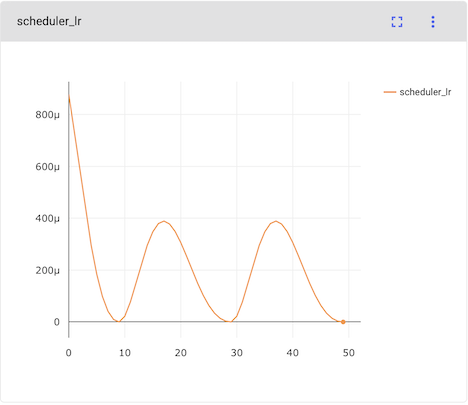

Scheduler Chaining
===================

Enchanter v0.6.0から Optimizer SchedulerのChaining に対応しました。

次のように学習率を動的に変更してみましょう。

これを実現するには、PyTorch v1.4から可能になったScheduler Chainingを利用するのが一番の近道です。
具体的には、``CosineAnnealingLR`` と ``ExponentialLR`` の２つを組み合わせることです。

早速コードを書いていきましょう。

.. code-block:: python

    from comet_ml import Experiment

    import torch.nn as nn
    import torch.optim as optim
    from torch.utils.data import DataLoader
    from torch.optim.lr_scheduler import ExponentialLR, CosineAnnealingLR

    from sklearn.datasets import load_iris
    from sklearn.model_selection import train_test_split

    from enchanter import addons
    from enchanter import wrappers
    from enchanter.addons import layers
    from enchanter.engine.modules import fix_seed, get_dataset

    fix_seed(0)
    experiment = Experiment()
    model = layers.MLP([4, 512, 128, 3], addons.mish)
    optimizer = optim.Adam(model.parameters())

次にRunnerを定義します。ここの変更点は、``scheduler`` を複数定義するだけです。

.. code-block:: python

    runner = wrappers.ClassificationRunner(
        model,
        optimizer=optimizer,
        criterion=nn.CrossEntropyLoss(),
        experiment=experiment,
        scheduler=[
            CosineAnnealingLR(optimizer, T_max=10, eta_min=1e-10),
            ExponentialLR(optimizer, gamma=0.9)
        ]
    )

最後にIrisデータセットを使いながら期待した通りの挙動になっているか確認しましょう。

::

    x, y = load_iris(return_X_y=True)
    x = x.astype("float32")
    y = y.astype("int64")

    x_train, x_test, y_train, y_test = train_test_split(x, y, random_state=0)
    x_train, x_val, y_train, y_val = train_test_split(x_train, y_train, random_state=0)

    train_ds = get_dataset(x_train, y_train)
    val_ds = get_dataset(x_val, y_val)
    test_ds = get_dataset(x_test, y_test)

    train_loader = DataLoader(train_ds, batch_size=8)
    val_loader = DataLoader(val_ds, batch_size=8)
    test_loader = DataLoader(test_ds, batch_size=8)

    runner.add_loader("train", train_loader)
    runner.add_loader("val", val_loader)
    runner.add_loader("test", test_loader)

    runner.train_config(
        epochs=50
    )

    runner.run()
