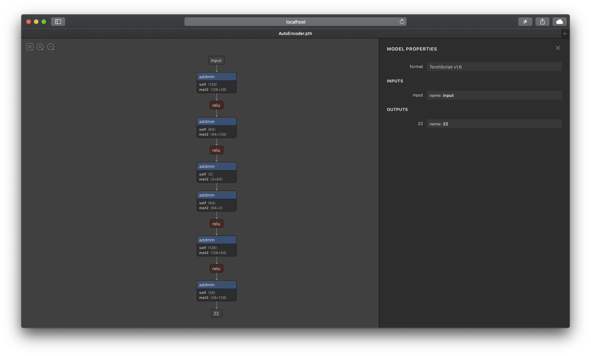

Visualize with Netron
=========================

::

    import torch
    import enchanter.addons.layers as L
    from enchanter.utils.visualize import with_netron

    x = torch.randn(1, 32)  # [N, in_features]
    model = L.AutoEncoder([32, 16, 8, 2])
    with_netron(model, (x, ))

